<div align="center">

# ⚡ RESONA
### **Ultra-Lightweight Offline Neural Text-to-Speech Engine**
*Expressive, Human-Like Speech with Authentic Hinglish Code-Switching & 21 Studio Personas*

---

[](https://www.python.org/)
[](models/)
[](#-benchmarks--performance)
[](#-key-features)
[](LICENSE)

<br/>

[🚀 Quick Start](#-quick-start) • [🎙️ 21 Voice Roster](#-studio-voice-roster-21-personas) • [🌐 Multilingual Routing](#-supported-languages--g2p-routing) • [📊 Architecture](#-pipeline-architecture) • [⚡ Benchmarks](#-benchmarks--performance)

---

</div>

<br/>

## 🌟 Why Resona?

Traditional TTS engines either require expensive cloud APIs with latency spikes or generate robotic, metallic voices when dealing with Indian languages and Hinglish code-switching. **Resona** solves this with an ultra-compact **82M parameter neural architecture** running 100% offline on standard consumer CPUs.

<br/>

<table>
  <tr>
    <td width="50%" valign="top">
      <h3>🇮🇳 Native Bilingual Code-Switching</h3>
      <p>Seamlessly transitions between English UI / technical terminology and native Hindi diction without unnatural accent distortion or robotic stutter.</p>
    </td>
    <td width="50%" valign="top">
      <h3>⚡ Real-Time Edge Latency</h3>
      <p>Generates speech in sub-second time on standard commodity CPUs (RTF &lt; 0.20x). Zero GPU or specialized hardware required.</p>
    </td>
  </tr>
  <tr>
    <td width="50%" valign="top">
      <h3>🫁 Natural Breathing Cadence</h3>
      <p>Built-in biological rhythm injector that inserts subtle 180ms clause pauses and 350ms sentence boundaries for conversational realism.</p>
    </td>
    <td width="50%" valign="top">
      <h3>🔒 100% Private & Air-Gapped</h3>
      <p>Zero external API calls, zero telemetry, and zero data leakage. All weights, style vectors, and lexicons run locally on your device.</p>
    </td>
  </tr>
</table>

---

## 📊 Pipeline Architecture

```mermaid
flowchart LR
    A[Raw Input Text] --> B[Text Normalizer]
    B --> C{Language Router}
    C -- Hinglish --> D[Hinglish Transducer]
    D --> E[Protected Tech Whitelist Guard]
    E --> F[Devanagari / IPA Phonemizer]
    C -- Multilingual / English --> F
    F --> G[Token & Rhythm Alignment]
    H[Voice Style Tensor 256-D] --> I[AdaIN Prosody Predictor]
    G --> I
    I --> J[82M Resona Neural Vocoder]
    J --> K[Natural Breathing Cadence]
    K --> L[Studio WAV Audio 24kHz]

    style A fill:#1e1e2e,stroke:#89b4fa,stroke-width:2px,color:#cdd6f4
    style D fill:#313244,stroke:#f38ba8,stroke-width:2px,color:#cdd6f4
    style E fill:#313244,stroke:#a6e3a1,stroke-width:2px,color:#cdd6f4
    style J fill:#45475a,stroke:#cba6f7,stroke-width:3px,color:#f5e0dc
    style L fill:#1e1e2e,stroke:#a6e3a1,stroke-width:2px,color:#a6e3a1
```



---

## 🚀 Quick Start

### 1. Installation

```bash
# Clone the repository
git clone https://github.com/MilannSharma/Resona.git
cd Resona

# Install package dependencies
pip install -e .
```

> **Note:** Requires `espeak-ng` installed on your host system (standard package on Linux/macOS, or via installer on Windows). Resona includes automatic multi-path discovery and CLI fallback.

<br/>

### 2. Python API

```python
from resona import ResonaPipeline

# 1. Initialize pipeline with flagship Hinglish voice (Anjura)
pipeline = ResonaPipeline(voice="anjura", language="hinglish")

# 2. Synthesize with natural code-switching & breathing cadence
text = "Resona audio engine se speech generate karna super fast aur natural hai. File menu par click kijiye."
result = pipeline.synthesize(text, output_path="output.wav", speed=0.95)

print(f"Generated {result.duration_seconds:.2f}s studio audio at {result.sample_rate}Hz!")
```

<br/>

### 3. Terminal CLI (`resona-tts`)

```bash
# List all 21 available Grade A personas
resona-tts --list-voices

# Synthesize speech directly from command line
resona-tts --text "Welcome to the Resona Neural Audio Engine." \
           --voice arjun \
           --output welcome.wav

# Synthesize Hinglish tutorial with custom speed multiplier
resona-tts --text "Settings menu par click kijiye aur resolution 1080p select kijiye." \
           --voice anjura \
           --lang hinglish \
           --speed 0.95 \
           --output settings.wav
```

---

## 🎙️ Studio Voice Roster (21 Personas)

All 21 voices include pre-rendered, high-fidelity reference `.wav` previews in [`resona/voices/samples/`](resona/voices/samples/):

### 🇮🇳 1. Hinglish & Indic Flagships (Studio Curated)
| Voice ID | Display Name | Gender | Persona Character | Pitch | Speed | Preview |
| :--- | :--- | :---: | :--- | :---: | :---: | :---: |
| `anjura` | **Anjura** | 👩 | Flagship Corporate Explainer | 184 Hz | 0.95x | [▶️ Preview](resona/voices/samples/anjura_preview.wav) |
| `divya` | **Divya** | 👩 | Deep, Articulate Explainer | 184.6 Hz | 0.95x | [▶️ Preview](resona/voices/samples/divya_preview.wav) |
| `meera` | **Meera** | 👩 | Warm Conversational Native Hindi | 210 Hz | 1.00x | [▶️ Preview](resona/voices/samples/meera_preview.wav) |
| `priya` | **Priya** | 👩 | Dynamic Tech Educator | 195 Hz | 1.00x | [▶️ Preview](resona/voices/samples/priya_preview.wav) |
| `arjun` | **Arjun** | 👨 | Enterprise Baritone Narrator | 115 Hz | 0.95x | [▶️ Preview](resona/voices/samples/arjun_preview.wav) |
| `kabir` | **Kabir** | 👨 | Executive Conversational Podcast | 128 Hz | 0.95x | [▶️ Preview](resona/voices/samples/kabir_preview.wav) |
| `aman` | **Aman** | 👨 | Agile Tech Walkthrough (Denoised) | 132 Hz | 1.00x | [▶️ Preview](resona/voices/samples/aman_preview.wav) |
| `atul` | **Atul** | 👨 | Classic Indic Corporate Voice | 122 Hz | 0.98x | [▶️ Preview](resona/voices/samples/atul_preview.wav) |

### 🎙️ 2. Indic English & Native Hindi Series
| Voice ID | Display Name | Gender | Persona Character | Pitch | Speed | Preview |
| :--- | :--- | :---: | :--- | :---: | :---: | :---: |
| `ananya` | **Ananya** | 👩 | Friendly Academic Explainer | 190 Hz | 1.00x | [▶️ Preview](resona/voices/samples/ananya_preview.wav) |
| `nisha` | **Nisha** | 👩 | Calm, Gentle Corporate Presenter | 182 Hz | 0.98x | [▶️ Preview](resona/voices/samples/nisha_preview.wav) |
| `tara` | **Tara** | 👩 | Bright & Youthful Guide | 205 Hz | 1.00x | [▶️ Preview](resona/voices/samples/tara_preview.wav) |
| `shivani` | **Shivani** | 👩 | Expressive Native Hindi | 215 Hz | 0.98x | [▶️ Preview](resona/voices/samples/shivani_preview.wav) |
| `dev` | **Dev** | 👨 | News Anchor & Tech Broadcast | 120 Hz | 1.00x | [▶️ Preview](resona/voices/samples/dev_preview.wav) |
| `sameer` | **Sameer** | 👨 | Friendly Walkthrough Mentor | 125 Hz | 0.98x | [▶️ Preview](resona/voices/samples/sameer_preview.wav) |
| `ravi` | **Ravi** | 👨 | Deep Resonance Documentary Narrator | 112 Hz | 0.95x | [▶️ Preview](resona/voices/samples/ravi_preview.wav) |
| `soham` | **Soham** | 👨 | Soothing Classic Storyteller | 110 Hz | 0.92x | [▶️ Preview](resona/voices/samples/soham_preview.wav) |

### 🌍 3. Global & International Series
| Voice ID | Display Name | Gender | Persona Character | Pitch | Speed | Preview |
| :--- | :--- | :---: | :--- | :---: | :---: | :---: |
| `heart` | **Heart** | 👩 | Global Flagship American English | 190 Hz | 1.00x | [▶️ Preview](resona/voices/samples/heart_preview.wav) |
| `bella` | **Bella** | 👩 | Warm Engaging American Storyteller | 198 Hz | 1.00x | [▶️ Preview](resona/voices/samples/bella_preview.wav) |
| `sarah` | **Sarah** | 👩 | Articulate Professional Presenter | 188 Hz | 1.00x | [▶️ Preview](resona/voices/samples/sarah_preview.wav) |
| `adam` | **Adam** | 👨 | Confident Commercial Voiceover | 118 Hz | 1.00x | [▶️ Preview](resona/voices/samples/adam_preview.wav) |
| `michael` | **Michael** | 👨 | Natural Conversational Baritone | 114 Hz | 1.00x | [▶️ Preview](resona/voices/samples/michael_preview.wav) |

---

## 🌐 Supported Languages & G2P Routing

Resona provides universal phonemization and neural voice rendering across **10 global and regional languages**:

| Language | Code | G2P Engine | Default Flagship Voice |
| :--- | :---: | :---: | :---: |
| **Hinglish** | `hinglish` | Resona Hybrid Transducer + IPA | `anjura` |
| **Hindi** | `hi` / `hindi` | Devanagari eSpeak-NG IPA | `meera` |
| **English (US)** | `en` / `en-us` | American English IPA | `heart` / `arjun` |
| **English (UK)** | `en-gb` | British English IPA | `heart` |
| **Spanish** | `es` | Spanish G2P IPA | `heart` |
| **French** | `fr` | French G2P IPA | `heart` |
| **Italian** | `it` | Italian G2P IPA | `heart` |
| **Portuguese** | `pt` | Portuguese G2P IPA | `heart` |
| **Japanese** | `ja` | Romaji / Kana IPA | `heart` |
| **Mandarin Chinese**| `zh` / `cmn` | Pinyin IPA | `heart` |

---

## ⚡ Benchmarks & Performance

Measured on commodity consumer hardware (**Intel Core i7-12700H @ CPU, single thread**):

```text
┌──────────────────────────────────────┬─────────────┬─────────────┬──────────────┐
│ Metric                               │ Cloud APIs  │ Resona 82M  │ Advantage    │
├──────────────────────────────────────┼─────────────┼─────────────┼──────────────┤
│ Cold Start Latency                   │ 800 - 1500ms│ 180ms       │ 4.4x Faster  │
│ Real-Time Factor (RTF on CPU)        │ Network Dep │ 0.18x       │ 5.5x Realtime│
│ Words Per Second (WPS)               │ ~15 words/s │ 48 words/s  │ 3.2x Faster  │
│ Air-Gapped / Zero Internet Required  │ ❌ No       │ ✅ Yes      │ 100% Offline │
│ Memory Footprint (RAM)               │ N/A         │ ~420 MB     │ Ultra-Light  │
└──────────────────────────────────────┴─────────────┴─────────────┴──────────────┘
```

---

## 📁 Repository Structure

```text
Resona/
├── resona/                     # 100% Self-Contained Python package
│   ├── core/                   # Neural vocoder, ResonaModel, ResonaPipeline, CustomSTFT
│   ├── preprocessing/          # Normalizer, ResonaHinglishEngine, G2P phonemizer
│   ├── voices/                 # VoiceManager, registry.json, 21 style tensors & samples
│   ├── vocab/                  # Bundled lexicons, compound phrases & tech whitelist
│   └── cli.py                  # resona-tts CLI command
├── models/                     # Checkpoints (resona-indic-v1.pth, resona-v1.pth, config.json)
├── vocab/                      # Dictionaries: compound_phrases.json, hinglish_lexicon.json
├── examples/                   # Working python examples (01_quickstart.py, 02_hinglish_tutorial.py)
├── tests/                      # Automated test suite (model loading, voice registry, normalization)
├── docs/                       # Detailed Voice Catalog & specifications (VOICES.md)
├── pyproject.toml              # Build & packaging specifications (wheel + sdist)
└── checksums.sha256            # SHA-256 release integrity hashes
```

---

## 📄 License & Attribution

Resona is distributed under the [Apache License 2.0](LICENSE).  
Upstream architectural foundations and legal notices are detailed in [NOTICE](NOTICE).

<div align="center">
  <sub>Built with ❤️ for offline, privacy-first, and expressive speech synthesis.</sub>
</div>
